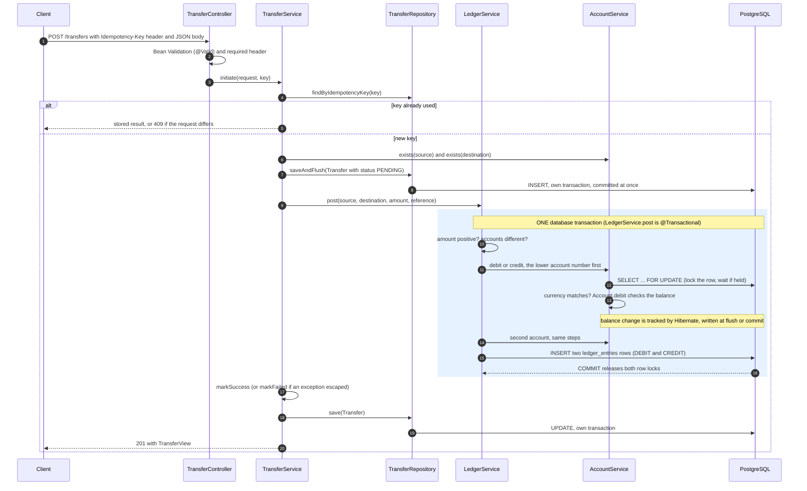
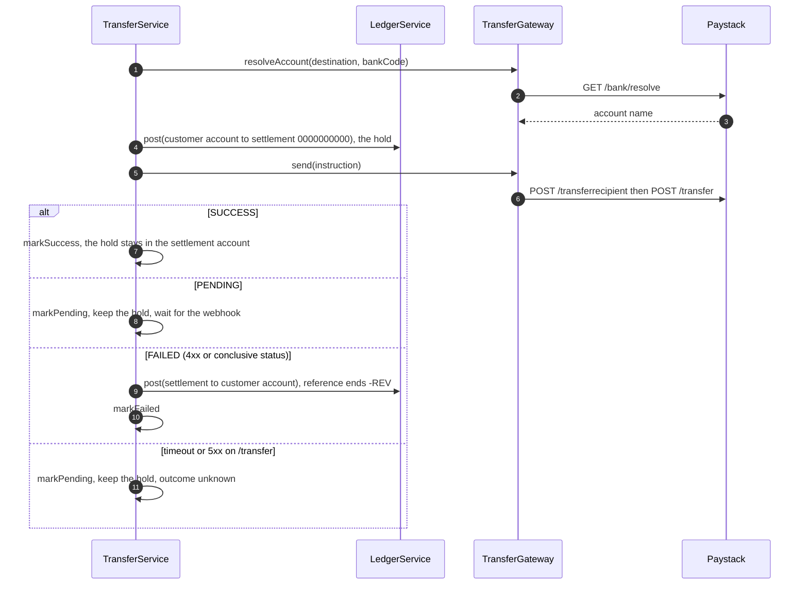
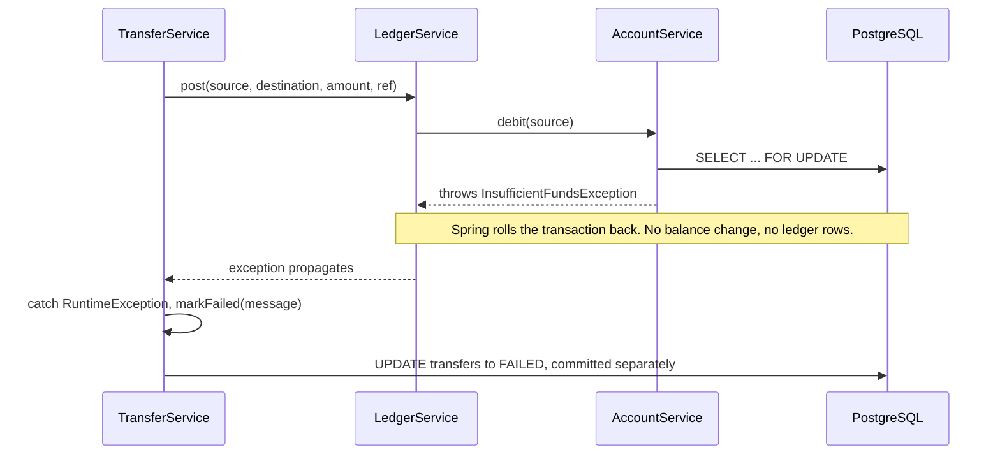
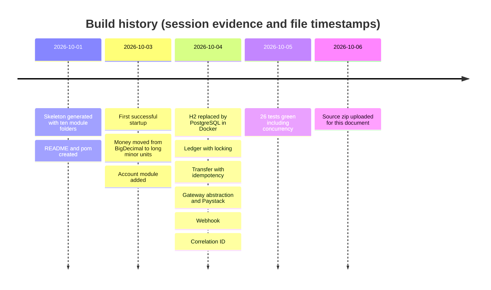
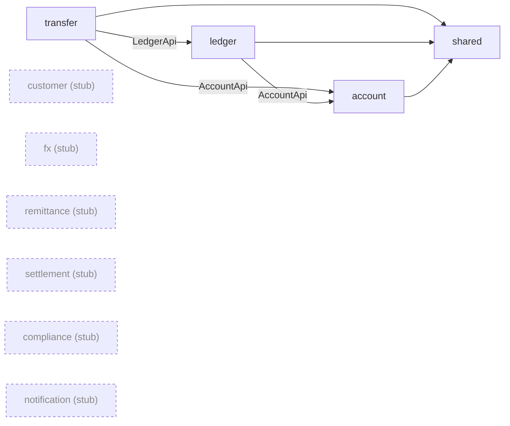
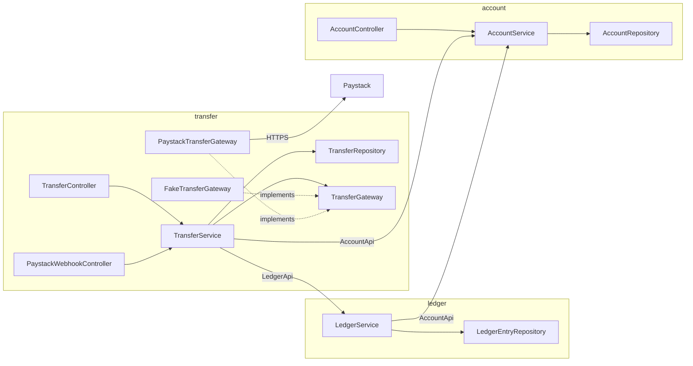

# PayBridge: Architecture, Evolution and Codebase Guide

| | |
|---|---|
| **Audience** | A backend developer joining the team |
| **Source analysed** | `paybridge.zip` as uploaded (project folder timestamp 2026-10-06 03:41) |
| **Stack** | Spring Boot 4.1.0, Java (compiled for release 21), PostgreSQL, Maven |
| **Read** | Every file under `src/main` and `src/test`, plus `pom.xml`, `application.yml`, `data.sql`, `README.md`, `Sandbox.md` |
| **Not done** | I did not compile or run anything (no Maven or Docker in my environment). Runtime facts come from output you pasted in the session. |

**Evidence tags.** **CODE** means I read it in a file, cited as `path:line` (relative to `src/main/java/com/academy/paybridge/` unless stated). **SESSION** means it came from logs or output you pasted in this conversation. **UNVERIFIED** means neither proves it. Every UNVERIFIED item is listed in Appendix A.

> **Two things to act on before anything else**
>
> 1. `application.yml` line 28 still holds a real-looking Paystack test secret as the default of `${PAYSTACK_SECRET_KEY:...}`, and the same key is inside the nested `paybridge-src.zip`. I deliberately do not reproduce it here. Regenerate it and change the line to `${PAYSTACK_SECRET_KEY:}`. See S1 in Section 4.
> 2. The upload has **no `.git` folder**, so Section 2 comes from the session history and file timestamps only. Send `git log --date=short --pretty=format:"%h %ad %s"` if you want it rebuilt from commits.

**Contents:** [1 Architecture and core flow](#1-architecture-and-core-flow) · [2 Evolution and lessons learned](#2-project-evolution-and-lessons-learned) · [3 Codebase dictionary](#3-codebase-dictionary) · [4 Limitations and next steps](#4-limitations-and-next-steps) · [Appendix A UNVERIFIED register](#appendix-a-unverified-register) · [Appendix B File inventory](#appendix-b-file-inventory)

---

## 1. Architecture and core flow

PayBridge is a modular monolith: one Spring Boot application, one PostgreSQL database, with modules that may only reach each other through their `api/` package. Three modules are real today: `account` (balances), `ledger` (atomic postings) and `transfer` (the use case, plus provider adapters). `shared` holds cross-cutting code. Six more modules are empty folders (Section 3).

### 1.1 Sequence diagram: an internal transfer

This is the **actual order of operations in the code**. Note one difference from the usual mental model: **balances are changed before the ledger rows are written**, not after (`LedgerService.java:33-43`). Both happen inside one transaction, so the order is invisible to other readers.



### 1.2 Step-by-step walkthrough

| # | What happens | Class and method | Location | Why it is built this way |
|---|---|---|---|---|
| 1 | Header and body are validated. A missing `Idempotency-Key` header gives 400. Blank accounts, non-positive amount or null currency give 400. | `TransferController.create`, `TransferRequest` annotations | `transfer/web/TransferController.java:20-25`, `transfer/api/TransferRequest.java` | Reject malformed input before any database work |
| 2 | The key is checked again, then looked up. A hit returns the stored transfer, or 409 if the request body differs. | `TransferService.initiate`, `replay` | `TransferService.java:53-63,150-160` | A retried request must never move money twice |
| 3 | Source account must exist (404 otherwise). Internal transfers also need the destination to exist. | `requireAccount` | `:72-78,166-170` | Fail before writing anything |
| 4 | A `PENDING` `Transfer` row is inserted and committed immediately. A unique-key collision means a concurrent request with the same key won, so we replay its row. | `transfers.saveAndFlush`, catch `DataIntegrityViolationException` | `:80-89` | The audit record must exist even if the money movement fails (ADR D6) |
| 5 | The ledger posting runs: amount must be positive, accounts must differ. | `LedgerService.post` | `ledger/service/LedgerService.java:24-31` | Cheap invariants before locks are taken |
| 6 | Accounts are locked and changed **in ascending account-number order**. Each `load` runs `SELECT ... FOR UPDATE`, checks the currency, then `Account.debit` or `credit` changes the in-memory balance. `debit` throws `InsufficientFundsException` if the balance is too low. | `AccountService.debit`, `credit`, `load`; `Account.debit`, `credit`; `AccountRepository.findForUpdateByAccountNumber` | `LedgerService.java:33-41`; `AccountService.java:27-45`; `Account.java:46-55`; `AccountRepository.java:13-14` | Row locks serialize competing transfers. Fixed lock order prevents deadlock. |
| 7 | Two `LedgerEntry` rows are saved: one `DEBIT` on the source, one `CREDIT` on the destination, same amount and reference. | `LedgerEntryRepository.save` | `LedgerService.java:42-43` | The journal of what happened, written in the same transaction as the balances |
| 8 | The transaction commits, releasing both row locks. Any exception rolls back steps 6 and 7 together. | Spring `@Transactional` proxy | `LedgerService.java:24` | All-or-nothing |
| 9 | The outcome is recorded: `markSuccess`, or `markFailed(message)` if any `RuntimeException` came out of step 5-8. | `processInternal` | `TransferService.java:102-109` | Failures are data, not 500s |
| 10 | The row is saved again and a `TransferView` returned. **HTTP 201 is returned for every outcome**, `FAILED` included. | `transfers.save`, `toView` | `:97`, `:172-175` | The request was processed. The result is in the body. |

### 1.3 External transfers: the same engine with a hold

When the request carries a `bankCode`, the transfer is external. The ledger cannot pay a bank, so money is first **held** in the system settlement account, then the provider is asked to send it.



The rule behind the diagram: **refund only when the provider confirms nothing was sent.** On an unknown outcome a refund could pay the customer twice, once by us and once by the bank. See `processExternal`, `TransferService.java:111-141`, and the webhook that resolves `PENDING` later, `settleFromProvider`, `:177-196`.

### 1.4 Money representation

`Money` is `record Money(long minorUnits, Currency currency)` (`shared/money/Money.java`). `100000` NGN means ₦1,000.00.

| Aspect | What the code does |
|---|---|
| Storage | Whole kobo or cents in a `long`. Database columns are `balance_minor` and `amount_minor` (`Account.java:25`, `LedgerEntry.java`, `Transfer.java:40`). |
| Parsing | `Money.of("1500.50", NGN)` rounds to 2 decimals with `HALF_EVEN`, shifts the point, and uses `longValueExact()` so overflow throws. |
| Arithmetic | `add` and `subtract` use `Math.addExact` / `subtractExact`, so overflow throws instead of wrapping (`Money.java:25,30`). |
| Safety | Mixed-currency operations throw `IllegalArgumentException` (`:58-62`). The compact constructor rejects a null currency. |
| API surface | DTOs expose raw `long` fields (`amountMinor`, `balanceMinor`). `Money` is used inside the JVM only. |

**Why `long` and not `BigDecimal`:** the first version used `BigDecimal` (SESSION). It was replaced because Nigerian providers, Paystack included, already work in kobo, integer maths cannot create fractions, and overflow can be made loud. **Trade-offs:** every currency is assumed to have 2 decimals (`setScale(2, ...)`, `BigDecimal.valueOf(minorUnits, 2)`), so a currency with 0 or 3 decimals would need a `decimals` value on `Currency`. A future `fx` module will need `BigDecimal` for rates, with an explicit rounding rule when converting back.

**What is actually used.** In `src/main`, only `Money.ofMinor`, `isPositive`, `minorUnits()` and `currency()` are called. `Money.of`, `add`, `subtract`, `isZero`, `isLessThan` and `toMajor` are used by tests or not at all. Balance arithmetic itself happens on raw `long` fields inside `Account` (`balanceMinor -= amountMinor`, and `Math.addExact` on credit, `Account.java:46-55`). So `Money` is a typed carrier today, not the calculation engine.

### 1.5 Ledger model

**Structure.** One `ledger_entries` row per side of a posting (`ledger/domain/LedgerEntry.java`): `account_number`, `type` (`DEBIT` or `CREDIT`), `amount_minor` (always positive, direction lives in `type`), `currency`, `reference`, `created_at`. One call to `LedgerApi.post` writes exactly one `DEBIT` and one `CREDIT` for the same amount and reference. No code path updates or deletes ledger rows (no `delete` calls anywhere in `src/main`, CODE). Whether the database itself forbids it is UNVERIFIED (no triggers or grants were inspected).

**Worked example.** ₦1,000.00 from account `0000000001` (₦100,000.00) to `0000000002` (₦5,000.00):

| Account | Before (kobo) | After (kobo) | Ledger row |
|---|---:|---:|---|
| `0000000001` | 10,000,000 | 9,900,000 | `DEBIT 100000 ref=trf-...` |
| `0000000002` | 500,000 | 600,000 | `CREDIT 100000 ref=trf-...` |

(Those balances match the SESSION output after the first test transfer.)

**Invariants and what guarantees each**

| Invariant | Guaranteed by | Strength |
|---|---|---|
| A posting is exactly one debit and one credit of the same amount | One method, one `amount` variable, one transaction (`LedgerService.java:35-43`) | Code. No database constraint pairs the rows. |
| Both balances move by exactly that amount, in opposite directions | The same `amount` is passed to `debit` and `credit` in the same transaction | Code, tested (`LedgerServiceTest.movesMoneyAndWritesTwoEntries`) |
| Amount is positive, the two accounts differ | `LedgerService.java:26-31` | Code, tested |
| Both accounts hold the posting's currency | `AccountService.load` (`:41-43`) | Code |
| A balance never goes negative | `Account.debit` (`:46-51`), serialized by the row lock | Code and lock. No `CHECK` constraint. |
| Money is conserved: the sum of all balances does not change in a posting | Follows from the two rows above | Holds for postings. Seeds add money outside the ledger (below). |
| Either all of it happens or none of it | `@Transactional` on `LedgerService.post` | Strong, tested (`debitIsRolledBackWhenCreditFails`) |

**What is not guaranteed.** An account's balance is a stored column, updated alongside the entries. Nothing checks that the two agree. They cannot agree from entries alone, because the seed balances in `data.sql` are inserted directly with no opening-balance entries. A reconciliation job would need opening entries first.

### 1.6 Concurrency, transactions and idempotency

**Lock strategy: pessimistic first, optimistic as a backstop.**

- `AccountRepository.findForUpdateByAccountNumber` is annotated `@Lock(PESSIMISTIC_WRITE)` (`:13-14`), which becomes `SELECT ... FOR UPDATE`. A second transfer touching the same account waits until the first commits. `AccountService.load` is the only caller (`:39`).
- `Account` also has a JPA `@Version` column (`Account.java:28-29`). With the row lock held it should never fire. It would catch a code path that forgot the lock.
- `TransferRepository.findForUpdateByReference` takes the same kind of lock for webhook settlement (`:14`).

**Lock ordering.** `LedgerService.post` touches the lower-numbered account first, whichever direction the money flows (`:33-41`). Without that, transfer A to B locks A then B while a simultaneous B to A locks B then A, and each waits for the other forever. With it, both lock the lower account first, so one simply waits. `ConcurrentTransferTest.oppositeDirectionTransfersDoNotDeadlock` exercises this (SESSION: passed, on H2).

**Transaction boundaries**

| Method | Transaction | Notes |
|---|---|---|
| `TransferService.initiate` | **None, on purpose** | Each repository call commits by itself. A comment at `:51` records the intent. |
| `LedgerService.post` | `@Transactional` (`:24`) | The unit of atomicity for a posting |
| `AccountService.debit`, `credit` | `@Transactional` (`:27,33`) | Default propagation `REQUIRED`: they **join** the ledger's transaction |
| `AccountService.open` | `@Transactional` (`:47`) | |
| `AccountService.getByNumber`, `findByNumber` | `@Transactional(readOnly = true)` (`:56,63`) | |
| `TransferService.settleFromProvider` | `@Transactional` (`:177`) | Lock, refund and status change commit together |
| Every `transfers.save...` call | One short transaction each (Spring Data default) | |

**Isolation level.** The code never sets one: no `isolation`, `propagation` or `rollbackFor` appears anywhere in `src/main` or `pom.xml` (CODE, verified by search). PostgreSQL's default is `READ COMMITTED`, and that is what you get (general database knowledge, not shown in a file). It is enough here *because* the lock is taken first: after waiting for a `FOR UPDATE` lock, PostgreSQL re-reads the latest committed version of the row, so the balance check sees the true value. H2's behaviour under the same code is UNVERIFIED. The connection pool and `open-in-view` are also unconfigured and use Spring Boot defaults (UNVERIFIED, not read from any file).

**Why `initiate` is not transactional.** If the whole method were one transaction and the ledger threw, the rollback would also erase the `PENDING` row, and you could never record `FAILED`. Splitting the work means the audit row survives. The cost is that the steps are not atomic across a crash.

**Idempotency**

| Situation | Behaviour | Where |
|---|---|---|
| Same key, same request | Returns the stored transfer, including a stored `FAILED` or `PENDING` | `TransferService.java:60-63,150-160` |
| Same key, different request | `IllegalStateException`, mapped to 409 | `:156-158`, `GlobalExceptionHandler.java:28-31` |
| Two first requests with the same key at once | The unique constraint on `transfers.idempotency_key` stops the loser, who replays the winner | `Transfer.java:26-27`, `TransferService.java:84-89` |
| Duplicate webhook | Row lock plus the check that status is still `PENDING` makes it a no-op | `:177-196`, `TransferSettlementTest` |
| Client retry after `FAILED` | Returns the same `FAILED`. A new key is required to try again. | by design |

**Failure and rollback matrix**

| Scenario | What rolls back | What persists | What the client sees |
|---|---|---|---|
| Insufficient funds (internal) | The whole ledger transaction | The `Transfer` row, updated to `FAILED` with the message | 201, `status: FAILED` |
| Credit account missing inside the ledger | Debit and everything else | `Transfer` row as `FAILED` | 201, `FAILED` |
| Lock timeout, deadlock or connection error | The ledger transaction | `Transfer` row as `FAILED`. A transient infrastructure error becomes a *terminal* result for that key (UNVERIFIED, not tested). | 201, `FAILED` |
| External: the hold fails | Nothing was moved | `Transfer` as `FAILED` | 201, `FAILED` |
| External: provider confirms failure | The hold had committed. A second posting reverses it (`-REV`). | `FAILED`, balances restored | 201, `FAILED` |
| External: provider outcome unknown (timeout, 5xx) | Nothing | Hold stays, `PENDING` | 201, `PENDING`. Resolved by the webhook. |
| Reversal posting itself throws | Only the reversal | Hold stays, row stays `PENDING`, error escapes `initiate` | Error response (S5) |
| JVM crash after `PENDING` insert, before the ledger | Nothing | `PENDING` row, no money moved | Nothing recoverable for the client. See S6. |
| JVM crash after an **internal** ledger commit, before `markSuccess` | Nothing | Money moved, row stuck `PENDING`, and `settleFromProvider` ignores internal transfers (`:184`) | A permanent `PENDING` (S6) |

Failure inside the ledger, in sequence:



Only unchecked exceptions trigger rollback with the defaults used here. Every exception thrown in `src/main` is a `RuntimeException`, so this holds today (CODE). A future checked exception thrown inside `post` would **not** roll it back unless `rollbackFor` is added.

---

## 2. Project evolution and lessons learned

**Evidence limits.** There is no git history in the upload. This section comes from the conversation and from file timestamps. Timestamps show when a file was last saved, so they are upper bounds on when a feature was written. "Alternatives considered" lists only alternatives that actually appeared in the session. Where none did, it says so, and does not invent any.



### 2.1 Key architectural decisions

**D1. Modular monolith with `api/`-only access between modules**
- **Decision:** one deployable, modules reach each other only through `api` packages, enforced by a test.
- **Alternatives considered:** none recorded in the session. The design came with the project's `README.md`.
- **Reason:** microservice-style boundaries without distributed-systems cost, and the option to extract a module later.
- **Trade-off:** the boundary is a *test*, not a compiler rule. Repository and service classes must be `public`, so Java itself will not stop a bad import.

**D2. Boundary enforcement with ArchUnit**
- **Decision:** `ModuleRulesTest` fails if code outside a module depends on that module's `domain`, `repository`, `service`, `web` or `client` packages (`ModuleRulesTest.java:13-31`).
- **Alternatives considered:** Spring Modulith, named alongside ArchUnit in the first plan (SESSION).
- **Reason:** a few lines of test, no extra framework.
- **Trade-off:** it does not detect dependency cycles. It checks nothing for modules that have no classes yet. A new module must be added to its `MODULES` list.

**D3. Layered packages instead of `internal/`**
- **Decision:** `api / domain / repository / service / web / client` per module.
- **Alternatives considered:** the first plan used `api/` plus `internal/` (SESSION). Your skeleton already used layers, so the plan was adapted.
- **Reason:** match the structure you had built.
- **Trade-off:** more packages, and the first architecture test searched for `..internal..`, a package that did not exist, so it passed while checking nothing.

**D4. Money as `long` minor units**
- **Decision:** see Section 1.4.
- **Alternatives considered:** `BigDecimal` (the first implementation, SESSION).
- **Reason:** providers work in kobo, integer maths is exact, overflow can be made loud.
- **Trade-off:** fixed 2-decimal assumption, `Money` mostly a carrier, FX will need `BigDecimal`.

**D5. Atomic ledger with pessimistic locks and ordered acquisition**
- **Decision:** one `@Transactional` posting, `FOR UPDATE` on each account, lower account number first.
- **Alternatives considered:** the plan's hint named `@Lock(PESSIMISTIC_WRITE)` *or* `@Version` (SESSION). Both ended up in the code, the lock as the mechanism and the version column as a backstop. Ordered acquisition was added in the concurrency step after a design review, **not** because a test failed (SESSION).
- **Reason:** serialize competing transfers on the same account, and avoid deadlock between opposite transfers.
- **Trade-off:** correctness depends on database lock semantics, which the tests prove on H2 only. `@Version` alone would have turned contention into retries.

**D6. `TransferService.initiate` is deliberately not `@Transactional`**
- **Decision:** a record is saved as `PENDING` first, committed on its own, then the ledger runs in its own transaction.
- **Alternatives considered:** a single transaction around everything (the first draft of the flow, SESSION). Rejected because a rollback would delete the very record that should say `FAILED`.
- **Reason:** keep an audit trail for every attempt.
- **Trade-off:** a crash can leave a `PENDING` row, and for internal transfers possibly with the money already moved (S6).

**D7. Hold money in a settlement account before calling a provider**
- **Decision:** external transfers first post customer to `0000000000`, then ask the provider.
- **Alternatives considered:** none recorded. (Not discussed: debiting after the provider confirms.)
- **Reason:** the customer cannot spend the same money twice while the provider call is in flight.
- **Trade-off:** the settlement account becomes a hot row and is never debited on success (S8).

**D8. Unknown outcome means `PENDING`, never a refund**
- **Decision:** a timeout or 5xx on the provider's transfer call keeps the hold and waits for the webhook.
- **Alternatives considered:** none recorded. This came from the explicit design principle in the session.
- **Reason:** refunding when the bank might have paid risks paying twice.
- **Trade-off:** without a reconciliation job, a lost webhook means money held indefinitely (S4).

**D9. A `TransferGateway` interface with a fake first, then Paystack, selected by profile**
- **Decision:** `FakeTransferGateway` (`@Profile("!paystack")`) and `PaystackTransferGateway` (`@Profile("paystack")`).
- **Alternatives considered:** the provider research in `Sandbox.md` lists Monnify, Squad, Interswitch, Flutterwave, Fincra, Korapay and Anchor. Paystack was picked for local transfers because of its clear docs and free test mode (SESSION).
- **Reason:** everything is buildable and testable offline. The provider can be swapped without touching `TransferService`.
- **Trade-off:** the profile mechanism means both gateways cannot run at once, and a second provider must adjust the fake's profile expression.

**D10. Idempotency by unique key, with replay of stored results**
- **Decision:** unique `idempotency_key`, pre-check, catch the constraint violation (Section 1.6).
- **Alternatives considered:** none recorded.
- **Reason:** safe client retries on a money-moving endpoint.
- **Trade-off:** keys are global and never expire. A stored `FAILED` is replayed forever, so clients must use new keys to retry.

**D11. Webhook trust through signature on the raw body, plus a state guard**
- **Decision:** HMAC-SHA512 over the raw bytes, constant-time compare, then lock and check `PENDING` (`PaystackWebhookController.java:72-86`, `TransferService.java:177-196`).
- **Alternatives considered:** none recorded.
- **Reason:** the signature proves the sender, the guard makes duplicates harmless.
- **Trade-off:** the webhook secret is the same value as the API key, so a leaked API key also allows forged webhooks (S1).

**D12. PostgreSQL at runtime, H2 in tests**
- **Decision:** the app runs on Docker PostgreSQL, while `src/test/resources/application.properties` overrides the datasource with in-memory H2.
- **Alternatives considered:** staying on H2 for everything (the starting point). Testcontainers with PostgreSQL was proposed as a later step and never built (SESSION).
- **Reason:** realistic persistence for the app, fast tests with no Docker requirement.
- **Trade-off:** the tests cannot prove PostgreSQL-specific behaviour (Section 2.3).

**D13. Hibernate `ddl-auto: update` instead of migrations**
- **Decision:** let Hibernate create and alter tables.
- **Alternatives considered:** Flyway was in the very first plan and the `db/migration/` folder was created for it (SESSION, CODE: folder holds only `.gitkeep`). The transfer-first plan dropped it.
- **Reason:** speed while the schema was changing daily.
- **Trade-off:** no versioned history of the schema, and Hibernate will not safely evolve column types.

**D14. Central error handling**
- **Decision:** one `@RestControllerAdvice` returning `{"error": ..., "message": ...}` (`GlobalExceptionHandler.java`).
- **Alternatives considered:** none recorded.
- **Reason:** unknown accounts were returning 500, an expected rough edge flagged in the plan and fixed later.
- **Trade-off:** coarse mapping (all `IllegalStateException` become 409), messages leaked verbatim, no catch-all (Section 4).

**D15. Log4j2 as the logging backend**
- **Decision:** `pom.xml` excludes `spring-boot-starter-logging` and adds `spring-boot-starter-log4j2`.
- **Alternatives considered:** not recorded.
- **Reason:** **not recorded in the session.** It sits next to a security-override comment dated 2026-10-01 that mentions a Mend scan, which suggests a dependency-vulnerability motive. That is a guess and is marked UNVERIFIED.
- **Trade-off:** the correlation-ID pattern in `application.yml` is written in Logback style (S12).

### 2.2 Problems hit and their fixes

| # | Symptom | Root cause | Fix |
|---|---|---|---|
| P1 | 12 errors: `cannot find symbol: variable minorUnits` in `Money.java` | The record header declared `minorUnit` (singular) while every method used `minorUnits` | Rename the component to `minorUnits` |
| P2 | `MoneyTest`: `cannot find symbol Money` | After `Money` moved to `shared.money`, the test still had the old package and folder | Move the test to `test/.../shared/money/` and fix its `package` line |
| P3 | `curl` returned 404 for `/accounts/...` while the build was failing; later "Port 8080 was already in use" | An old app instance with no `/accounts` endpoint still held port 8080 | `netstat -ano \| findstr :8080`, then `taskkill /PID <pid> /F`, then restart |
| P4 | 500 from `GET /accounts/0000000001` on a running instance | **UNVERIFIED.** The log was never captured. The same URL returned the account after a clean restart. | Clean restart |
| P5 | `Could not find goal ''` | A space in `spring-boot: run` | Type `spring-boot:run` |
| P6 | PowerShell errors such as `Get-Process : A positional parameter cannot be found...` | The prompt text `PS C:\...>` was pasted with the command (`PS` is an alias for `Get-Process`). Related: `curl` is a PowerShell alias, and JSON needs `\"` escaping. | Paste only the command, use `curl.exe`, escape quotes |
| P7 | 11 test errors, all "ApplicationContext failure threshold (1) exceeded". The real cause was `Driver org.postgresql.Driver claims to not accept jdbcUrl, jdbc:h2:mem:paybridge-test`. | The main YAML's `driver-class-name` and Postgres `dialect` were merged into the test configuration | Remove both from `application.yml` (they are auto-detected) and set `spring.datasource.driver-class-name=org.h2.Driver` in the test properties |
| P8 | The same 11 errors, root cause `mapping values are not allowed here` | A YAML indentation error introduced with the `paystack:` block | Replaced with a known-good file. The error means *syntax*, not database. |
| P9 | The app would not start on PostgreSQL; a Hibernate stack trace (the full cause was never pasted) | **Probable** credential mismatch: YAML defaults `postgres` / `mysecretpassword` against a container user `paybridge`. Exact error UNVERIFIED. | Datasource defaults changed to `paybridge` / `paybridge` (CODE: current YAML). The app then ran (SESSION). |
| P10 | `relation "transfers" does not exist` in `psql` | The app had not yet started against PostgreSQL (tests use H2), and Hibernate creates tables on first start | Start the app. `\dt` then showed `accounts`, `ledger_entries`, `transfers`. |
| P11 | Anticipated, fixed before it bit: no seed data on PostgreSQL, duplicate-key errors on restart | Spring runs `data.sql` automatically only for embedded databases, and plain `INSERT`s would repeat on a persistent database | `spring.sql.init.mode: always` and `WHERE NOT EXISTS` inserts |
| P12 | `cannot find symbol: bankCode()` and "no suitable constructor `Transfer(...)`" | `TransferService` was updated before `TransferRequest` and `Transfer` gained the new field and constructor argument | Add `bankCode` to both |
| P13 | `cannot find symbol` for `GatewayStatus`, `Transactional`, `TransferStatus` | Imports missing after adding `settleFromProvider` | Add the three imports |
| P14 | `cannot resolve log` and `request` | The log statement was pasted at class level, with no logger field | Declare the logger and move the call into `initiate` |
| P15 | `'credit(String, Money)' is already defined` | The same method block was pasted twice into `AccountService` | Delete the duplicate |
| P16 | The architecture test always passed | It looked for `..internal..`, which did not exist in the layered layout (see D3) | Rewritten around the real packages |
| P17 | Would have failed on first Paystack call: the reference format | Paystack accepts lowercase references only (per the docs read in the session), and ours began `TRF-` | Changed the prefix to `trf-` (`TransferService.java:81`), gateway lowercases again (`PaystackTransferGateway.java:89`) |
| P18 | A real-looking secret key found in `application.yml:28` | The `${VAR:default}` placeholder was given the actual key as its default | **Still present at upload.** Regenerate the key and remove the default (S1). |

### 2.3 H2 versus PostgreSQL: the differences that mattered

| Area | H2 (tests) | PostgreSQL (app) | Consequence |
|---|---|---|---|
| Schema lifecycle | `create-drop`: fresh schema every run | `update`: tables and rows persist | Manual runs accumulate balances (SESSION: `9900000`). Seeds must be safe to repeat. |
| Seed script | Runs automatically for an embedded database | Needs `spring.sql.init.mode: always` | Seed accounts were missing until set (P11) |
| Datasource config | Needs the H2 driver | Needs the Postgres driver | The merged-YAML clash (P7) |
| Locking | `LOCK_TIMEOUT=10000` was added to the test URL so concurrent tests wait instead of failing at once | Real row locks with deadlock detection. Wait-time settings were not examined. | The concurrency tests give confidence, not proof (U4) |
| Isolation and `FOR UPDATE` re-read behaviour | Not examined | Documented `READ COMMITTED` behaviour that the design relies on | UNVERIFIED on H2 |
| Column types and `Instant` mapping | Not examined | Not examined | UNVERIFIED (no DDL compared) |
| Shared state | One in-memory database for all test classes | Persistent | Tests use before/after comparisons, not absolute balances |

### 2.4 Notable refactors, first design to now

| From | To | Why |
|---|---|---|
| `BigDecimal` amount in `Money`, `Account` and DTOs | `long` minor units everywhere (`balanceMinor`, `amountMinor`) | Section 1.4 |
| Plan: `api/` + `internal/`, with a separate `AccountApiImpl` | Layered packages, and `AccountService implements AccountApi` | Fewer classes, and it matched your skeleton |
| `AccountApi` with lookups only | Added `debit` and `credit`, plus `Account.debit/credit` and the locking query | So the ledger can change balances without touching `account.domain` |
| One internal transfer flow | Internal and external flows, hold and reversal, `PENDING` handling | Needed for a provider |
| `Transfer`: reference, status, accounts | Added `bankCode`, `providerReference`, `markPending(...)`. `markSuccess()` became `markSuccess(String)`, **leaving the old no-argument method behind unused** (`Transfer.java:66`). | Provider support |
| `LedgerService`: debit then credit | Account-number-ordered acquisition | Deadlock prevention |
| Unmapped exceptions (500 on unknown account) | `ResourceNotFoundException` plus `GlobalExceptionHandler` | Clean errors |
| H2 for everything | PostgreSQL for the app, H2 for tests | Persistence |
| `data.sql` with plain inserts | Guarded inserts plus the settlement account | Repeatable seeding, external transfers |
| Reference `TRF-<uuid>` | `trf-<uuid>` | Provider rule (P17) |
| No webhook | `PaystackWebhookController`, `settleFromProvider`, `findForUpdateByReference` | Resolve `PENDING` transfers |
| No request tracing | `CorrelationIdFilter` and a log pattern | Follow one request through the logs (works only if the pattern is valid, U3) |

---

## 3. Codebase dictionary

### 3.1 Annotated directory tree

Module boundaries enforced by `ModuleRulesTest`: for each of the nine modules, only its `api/` package is visible to others. `shared` is open to all.

```
paybridge/
├── pom.xml                          Maven build: Boot 4.1.0, JPA, validation, web, Log4j2, ArchUnit, security-version overrides
├── README.md / Sandbox.md           Project blurb (outdated) and provider research notes
├── src/main/java/com/academy/paybridge/
│   ├── PayBridgeApplication.java    Entry point; component scan covers every module
│   ├── shared/                      OPEN to all modules (not boundary-checked)
│   │   ├── money/                   Money value object and Currency enum
│   │   ├── exception/               Domain exceptions and the global REST error mapping
│   │   ├── config/                  CorrelationIdFilter (request tracing)
│   │   └── audit/                   EMPTY stub (planned JPA auditing)
│   ├── account/                     IMPLEMENTED. Owns accounts and balances.
│   │   ├── api/                     PUBLIC: AccountApi, AccountView
│   │   ├── domain/                  PRIVATE: Account entity
│   │   ├── repository/              PRIVATE: Spring Data repository with the locking lookup
│   │   ├── service/                 PRIVATE: AccountService (implements AccountApi)
│   │   └── web/                     PRIVATE: AccountController
│   ├── ledger/                      IMPLEMENTED. Atomic posting of one debit and one credit.
│   │   ├── api/                     PUBLIC: LedgerApi
│   │   ├── domain/                  PRIVATE: LedgerEntry, EntryType
│   │   ├── repository/              PRIVATE: LedgerEntryRepository
│   │   └── service/                 PRIVATE: LedgerService (implements LedgerApi)
│   ├── transfer/                    IMPLEMENTED. The use case, plus provider adapters.
│   │   ├── api/                     PUBLIC: TransferApi, TransferRequest, TransferView
│   │   ├── domain/                  PRIVATE: Transfer, TransferStatus
│   │   ├── repository/              PRIVATE: TransferRepository
│   │   ├── service/                 PRIVATE: TransferService (implements TransferApi)
│   │   ├── client/                  PRIVATE: the TransferGateway seam, Fake and Paystack adapters
│   │   └── web/                     PRIVATE: TransferController, PaystackWebhookController
│   ├── customer/ compliance/ fx/ remittance/ settlement/ notification/
│   │                                STUBS: folders with .gitkeep files only (api, domain, repository, service, web,
│   │                                client, scheduler or listener as planned). No classes.
├── src/main/resources/
│   ├── application.yml              Runtime config (datasource, JPA, Paystack, logging)
│   ├── data.sql                     Idempotent seed: two test accounts and the settlement account
│   ├── db/migration/                EMPTY (.gitkeep). No Flyway, schema comes from Hibernate.
│   └── static/index.html            Placeholder landing page at "/"
└── src/test/
    ├── java/com/academy/paybridge/  Seven test classes (26 tests): architecture, money, ledger, transfer
    └── resources/application.properties   Test datasource override (H2 in memory)
```

### 3.2 Module tables

#### Application root

| Type | Name | Responsibility | Key collaborators |
|---|---|---|---|
| Class | `PayBridgeApplication` | `@SpringBootApplication` entry point. Component scan from `com.academy.paybridge` picks up all modules. | Spring Boot |

#### Module `shared`

| Type | Name | Responsibility | Key collaborators |
|---|---|---|---|
| Enum | `shared.money.Currency` | The supported currencies, `NGN` and `USD`. | `Money`, `Account`, `LedgerEntry`, `Transfer`, DTOs |
| Record | `shared.money.Money` | Immutable amount in minor units with overflow-checked arithmetic, comparisons and parsing from major-unit strings. | `Currency`, `LedgerApi`, `AccountApi`, `TransferService` |
| Class | `shared.exception.InsufficientFundsException` | Unchecked exception thrown when a debit would overdraw an account. | `Account.debit`, `GlobalExceptionHandler` |
| Class | `shared.exception.ResourceNotFoundException` | Unchecked exception for a missing account or transfer, mapped to 404. | `AccountService`, `TransferService`, `GlobalExceptionHandler` |
| Class | `shared.exception.GlobalExceptionHandler` | `@RestControllerAdvice` that turns exceptions into a status code and `{error, message}` JSON. | All controllers |
| Record | `GlobalExceptionHandler.ErrorResponse` | The error body shape. | `GlobalExceptionHandler` |
| Class | `shared.config.CorrelationIdFilter` | Accepts or generates `X-Correlation-Id`, puts it in the logging context, echoes it in the response, clears it afterwards. | Servlet container, SLF4J `MDC` |

#### Module `account`

| Type | Name | Responsibility | Key collaborators |
|---|---|---|---|
| Interface | `account.api.AccountApi` | Public contract: `findByNumber`, `exists`, `debit`, `credit`. The last two must run inside the caller's transaction. | `LedgerService`, `TransferService` |
| Record | `account.api.AccountView` | Read-only account snapshot (number, currency, `balanceMinor`, customer id). | `AccountApi`, `AccountController` |
| Entity | `account.domain.Account` | The `accounts` row. Owns the rule that a balance cannot go negative (`debit`, `credit`). Has a `@Version` column. | `AccountRepository`, `InsufficientFundsException` |
| Interface | `account.repository.AccountRepository` | Spring Data repository, including `findForUpdateByAccountNumber` with a pessimistic write lock. | `AccountService` |
| Class | `account.service.AccountService` | Implements `AccountApi`. Opens accounts (one per customer per currency), generates 10-digit numbers, and applies locked debits and credits. | `AccountRepository`, `Money` |
| Class | `account.web.AccountController` | REST endpoints `POST /accounts` and `GET /accounts/{accountNumber}`. | `AccountService` |
| Record | `AccountController.OpenAccountRequest` | Validated request body for opening an account. | `AccountController` |

#### Module `ledger`

| Type | Name | Responsibility | Key collaborators |
|---|---|---|---|
| Interface | `ledger.api.LedgerApi` | Public contract: `post(debitAccount, creditAccount, amount, reference)`. | `TransferService` |
| Enum | `ledger.domain.EntryType` | `DEBIT` or `CREDIT`. | `LedgerEntry` |
| Entity | `ledger.domain.LedgerEntry` | One side of a posting: account, type, positive amount, currency, reference, timestamp. | `LedgerEntryRepository` |
| Interface | `ledger.repository.LedgerEntryRepository` | Persistence for entries, plus `findByReference`. | `LedgerService`, tests |
| Class | `ledger.service.LedgerService` | Implements `LedgerApi`. Validates, applies the debit and credit in locked order, writes both entries, all in one transaction. | `AccountApi`, `LedgerEntryRepository` |

#### Module `transfer`

| Type | Name | Responsibility | Key collaborators |
|---|---|---|---|
| Interface | `transfer.api.TransferApi` | Public contract: `initiate(request, idempotencyKey)` and `getByReference`. | `TransferController`, tests |
| Record | `transfer.api.TransferRequest` | Validated request: source, destination, `amountMinor`, currency, optional `bankCode` (present means external). | `TransferController`, `TransferService` |
| Record | `transfer.api.TransferView` | Response snapshot of a transfer. | `TransferService`, `TransferController` |
| Enum | `transfer.domain.TransferStatus` | `PENDING`, `SUCCESS`, `FAILED`. | `Transfer` |
| Entity | `transfer.domain.Transfer` | The `transfers` row with unique `reference` and `idempotency_key`, and the status-changing methods. | `TransferRepository`, `TransferService` |
| Interface | `transfer.repository.TransferRepository` | Lookups by idempotency key and reference, and a pessimistic lookup for settlement. | `TransferService` |
| Class | `transfer.service.TransferService` | Implements `TransferApi`. Orchestrates idempotency, validation, the `PENDING` record, ledger calls, provider calls and webhook settlement. | `AccountApi`, `LedgerApi`, `TransferGateway`, `TransferRepository` |
| Class | `transfer.web.TransferController` | REST endpoints `POST /transfers` and `GET /transfers/{reference}`. | `TransferApi` |
| Class | `transfer.web.PaystackWebhookController` | `POST /webhooks/paystack`. Verifies the HMAC-SHA512 signature on the raw body, then settles pending transfers. | `TransferService`, Jackson `JsonMapper` |
| Records | `PaystackWebhookController.Event`, `.EventData` | Minimal shapes for parsing the webhook payload (event name, reference). | `PaystackWebhookController` |
| Interface | `transfer.client.TransferGateway` | The provider seam: `resolveAccount` (name enquiry) and `send`. | `TransferService` |
| Record | `transfer.client.AccountName` | Result of a name enquiry. | `TransferGateway` |
| Record | `transfer.client.TransferInstruction` | What to send: reference, account, bank code, recipient name, `Money`. | `TransferService`, gateways |
| Record | `transfer.client.GatewayResult` | The provider's answer: status, provider reference, message. | gateways, `TransferService` |
| Enum | `transfer.client.GatewayStatus` | `SUCCESS`, `PENDING`, `FAILED`. | gateways, `TransferService`, webhook |
| Class | `transfer.client.FakeTransferGateway` | Offline gateway, active unless the `paystack` profile is on. The last digit of the destination account picks the result (9 fails, 8 pends). | `TransferGateway` |
| Class | `transfer.client.PaystackTransferGateway` | Paystack adapter: name enquiry, recipient creation, transfer initiation, status mapping. Fails fast at startup when the key is blank. | Spring `RestClient`, Paystack API |
| Records | `PaystackTransferGateway.ResolveResponse`, `ResolveData`, `RecipientResponse`, `RecipientData`, `TransferResponse`, `TransferData` | Response shapes for the three Paystack calls (only the fields used). | `PaystackTransferGateway` |

#### Stub modules

`customer`, `compliance`, `fx`, `remittance`, `settlement`, `notification` contain **no classes**, only `.gitkeep` placeholders in their planned package folders. `shared/audit` is likewise empty.

#### Tests

| Type | Name | Responsibility | Key collaborators |
|---|---|---|---|
| Class | `ModuleRulesTest` | Fails if any module's internals are used from outside it (1 test). | ArchUnit |
| Class | `shared.money.MoneyTest` | Parsing, arithmetic, rounding, mismatch and overflow (8 tests). | `Money` |
| Class | `ledger.LedgerServiceTest` | Posting, overdraft, rollback of the debit, input validation (4 tests). | `LedgerApi`, `AccountApi` |
| Class | `transfer.TransferServiceTest` | Idempotency and internal and external flows with the fake gateway (7 tests). | `TransferApi`, `AccountApi` |
| Class | `transfer.TransferSettlementTest` | `settleFromProvider` outcomes and duplicates (3 tests). | `TransferService` |
| Class | `transfer.ConcurrentTransferTest` | 20 concurrent transfers and opposite-direction transfers (2 tests). | `TransferApi`, `JdbcTemplate` |
| Class | `transfer.client.PaystackStatusMappingTest` | Status mapping only, no HTTP (1 test). | `PaystackTransferGateway.mapStatus` |
| Resource | `src/test/resources/application.properties` | H2 in-memory datasource with a 10 s lock timeout. | all `@SpringBootTest` classes |

### 3.3 Module dependency diagrams

Module level, taken from the `import` statements (CODE):



Class level, showing who calls whom and what implements which contract:



---

## 4. Limitations and next steps

Everything below describes what the code does **today**.

### 4.1 Feature status

| Capability | Status | Notes |
|---|---|---|
| Accounts and balances | Working | No customer validation, no tests for this module |
| Atomic ledger | Working and tested | Proven on H2 only |
| Internal transfers | Working and tested | Idempotent, concurrency tested |
| External transfers through the fake gateway | Working and tested | All three outcomes |
| **External transfers through Paystack** | **Built, not proven.** See 4.2. | |
| Webhook settlement | Working, **verified by hand only** | No automated webhook test |
| Reconciliation of stuck transfers | **Not started** | `settlement/` is empty |
| Authentication and authorization | **Not started** | |
| `customer`, `fx`, `remittance`, `settlement`, `compliance`, `notification` | **Not started** | Empty folders. Cross-border and USD to NGN remittance from the README do not exist yet. |
| Schema migrations | **Not started** | Hibernate `update` |
| Health checks, metrics | **Not started** | No Actuator dependency |

### 4.2 External gateway integration: where it really stands

| Capability | Status | Evidence |
|---|---|---|
| Gateway seam and fake | Done | `transfer/client/*` |
| Paystack name enquiry, recipient, transfer calls | **Coded** against Paystack's docs as read in the session | `PaystackTransferGateway.java:67-137` |
| Error policy (no money moved means `FAILED`, unknown means `PENDING`) | Coded | `:96-137` |
| Status mapping | Coded and unit tested | `:140-149`, `PaystackStatusMappingTest` |
| **A confirmed real Paystack transfer** | **UNVERIFIED.** A `SUCCESS` was seen for key `ps-1`, but the fake gateway returns an identical response, and `provider_reference` was never shown (U2). | SESSION |
| HTTP-level tests with a mock server | None | `src/test/` |
| Webhook delivery from Paystack to a public URL (ngrok) | Not exercised. Only self-signed local events were sent. | SESSION |
| Fallback when a webhook never arrives (transfer verification API) | **Missing** | S4 |
| Recipient reuse | Missing. A recipient is created on every transfer. | `:94-105` |
| Bank-code validation or bank list | Missing | `bankCode` is a free string |
| Paystack test-mode restrictions (registered-business requirement, name-enquiry behaviour) | Unknown (U5) | |

### 4.3 Risks and gaps

Severity assumes the system were deployed. For a learning project, High items are lessons, not emergencies.

#### Security

| # | Sev | Finding | Evidence | Fix |
|---|---|---|---|---|
| **S1** | **High** | **Hard-coded secret default.** The Paystack test key is the fallback in `application.yml:28`, and the same key is in the nested zip. Three consequences: the fail-fast check at `PaystackTransferGateway.java:26` can never fire, the webhook controller (active in every profile) verifies signatures with that same value, and so **anyone holding the key can forge signed webhooks** that mark pending transfers successful or trigger refunds. | `application.yml:28`; `PaystackWebhookController.java:31-36,44` | Regenerate the key, use `${PAYSTACK_SECRET_KEY:}` with no default, delete the nested zip |
| **S2** | **High** | **No authentication or authorization.** Anyone can read balances, open accounts, and move money from any account by naming it as `sourceAccount`. | no security dependency in `pom.xml` | Spring Security, and bind `sourceAccount` to the caller |
| S3 | Med | **Error leakage and coarse mapping.** Every `IllegalStateException` becomes 409, raw messages are returned, including Paystack response bodies, and there is no catch-all. The 422 mapping for insufficient funds is effectively unreachable, because the exception is caught and recorded as a `FAILED` transfer (UNVERIFIED by test). | `GlobalExceptionHandler.java`; `PaystackTransferGateway.java:81-84` | Specific exception types and a logging catch-all |

#### Consistency

| # | Sev | Finding | Evidence | Fix |
|---|---|---|---|---|
| **S4** | **High** | **Stuck external transfers.** Nothing resolves a `PENDING` transfer if the webhook is lost, the app crashes between hold and send, or the provider call times out. The hold stays. | `TransferService.java:111-141` | A scheduled job that asks the provider for status and calls `settleFromProvider`. Check `ledger_entries.reference` to tell "hold made" from "no hold". |
| S5 | Med | **A failing reversal is unhandled.** `ledger.post(... -REV)` in the `FAILED` branch is outside any `try`. If it throws, `initiate` fails after the row is saved `PENDING` with the money still held. | `TransferService.java:135-139` | Catch it, keep `PENDING` with a note, let reconciliation retry |
| **S6** | **High** | **Internal transfers have no recovery path.** If the JVM dies after the ledger commit and before `markSuccess`, the money has moved but the row is `PENDING` forever, because `settleFromProvider` returns early for transfers without a `bankCode`. | `TransferService.java:102-109,184` | Reconcile internal transfers against `ledger_entries.reference` |
| S7 | Med | **Stale-overwrite race.** The final `transfers.save(transfer)` writes in-memory state and `Transfer` has no `@Version`. A webhook that settles the row in between is overwritten with `PENDING`. Money stays correct, status does not. Never observed (U8). | `TransferService.java:97` | `@Version` on `Transfer`, or reload under lock before the final write |
| S8 | Med | **Settlement account is a hot row and is never released.** Every external transfer and reversal locks `0000000000`, serializing them. On success the money is never moved out of it. | `TransferService.java:32,114,137,191` | Per-provider clearing accounts, move funds out on confirmation |
| S9 | Med | **Transient errors become terminal.** A lock timeout or connection error is recorded as `FAILED` and replayed forever for that key. | `TransferService.java:102-109` | Distinguish retryable errors from business rejections |
| S10 | Med | **Balance is not reconciled with entries.** Seed balances have no opening entries, and nothing compares stored balances with the journal. | `data.sql`; Section 1.5 | Opening-balance entries and a periodic check |
| S11 | Low | **Check-then-insert rules.** One account per customer per currency, and random account-number generation, have no unique constraint. A race produces an unmapped `DataIntegrityViolationException` (500). | `AccountService.java:49,77-83` | Unique constraints plus retry |

#### Data and operations

| # | Sev | Finding | Evidence | Fix |
|---|---|---|---|---|
| S12 | Med | **No migrations.** `ddl-auto: update`, an empty `db/migration/`, no Flyway. `show-sql: true` is on. No foreign keys, no `CHECK` constraints, no explicit indexes (only those implied by unique columns, so lookups by `ledger_entries.reference` are unindexed, UNVERIFIED). | `application.yml:15-16`; entities | Flyway, `ddl-auto: validate`, indexes and constraints |
| S13 | Low | **Correlation ID may not print.** Log4j2 is in use, but the pattern uses Logback-style `%X{correlationId:-}`. Never confirmed in the session (U3). | `application.yml:29-31`; `pom.xml` | Test it, try `%X{correlationId}` |
| S14 | Low | **Unconfigured runtime.** Connection pool size, `open-in-view` and transaction timeouts use framework defaults (UNVERIFIED), and there are no health or metrics endpoints. | no settings in files; no Actuator | Configure and expose health |
| S15 | Low | **Idempotency keys are global and never expire.** | `Transfer.java:26-27` | Scope per caller, add expiry |
| S16 | Low | **No limits or screening.** No per-transaction or daily limits, no sanctions checks. | `compliance/` empty | Build the module and call it before the hold |

#### Testing

| # | Sev | Finding | Fix |
|---|---|---|---|
| S17 | Med | **Tests run on H2 only**, so PostgreSQL lock and isolation behaviour is unproven (U4) | Testcontainers with PostgreSQL |
| S18 | Med | **No tests** for the `account` module, controllers, `GlobalExceptionHandler`, the webhook controller, the Paystack HTTP calls, `CorrelationIdFilter`, a failing reversal, or two simultaneous requests with the same key | Add them in that order |
| S19 | Low | **Environment trap.** If `SPRING_PROFILES_ACTIVE=paystack` is left set in a terminal, the tests use the real gateway | `@ActiveProfiles` on the test classes |

#### Code hygiene

`Transfer.markSuccess()` (no argument) is unused. `Money.add`, `subtract`, `isZero`, `isLessThan`, `toMajor` and `Money.of` are not called from `src/main`. `AccountApi.java` imports `Money` twice. `.gitkeep` files remain in packages that now have classes. `README.md` omits profiles, environment variables, Paystack and the webhook, and lists planned modules as if present. `static/index.html` is titled "D.Money.Transfer". `Sandbox.md` still says it cannot search the web, which predates the Paystack docs check. `event.json` and `paybridge-src.zip` sit in the project root and are not in `.gitignore`. A compile warning about a deprecated API in `GlobalExceptionHandler` was seen in the session, and which API it refers to is UNVERIFIED.

### 4.4 Suggested next steps

| When | Step | Why |
|---|---|---|
| **Now** | Regenerate the Paystack key, remove the default, delete `paybridge-src.zip` and `event.json` | S1 |
| **Now** | Confirm one real Paystack test transfer: `select reference, status, provider_reference from transfers order by id desc limit 3;` and look for a `TRF_` code and a dashboard entry | Closes U2 |
| **Next** | Reconciliation job for `PENDING` transfers, external and internal | Closes S4, S6 and mostly S7 |
| **Next** | Handle the reversal failure, then add tests for it | S5 |
| **Next** | Testcontainers with PostgreSQL, then tests for `account`, the webhook and the exception handler | S17, S18 |
| **Next** | Flyway, `ddl-auto: validate`, constraints and indexes | S12, S11 |
| **Later** | Authentication, authorization and per-caller idempotency scope | S2, S15 |
| **Later** | `customer` module, then `compliance` limits ahead of the hold | S16 |
| **Later** | `fx`, `remittance`, `settlement` and `notification`, in the order the README plans them | Product scope |

---

## Appendix A. UNVERIFIED register

| # | Item | Why unverified |
|---|---|---|
| U1 | Git history | No `.git` folder in the upload |
| U2 | That `ps-1` reached the real Paystack | The fake gateway returns the same `SUCCESS` body, and `provider_reference` was never shown |
| U3 | That the correlation ID prints in log lines | Log4j2 with a Logback-style pattern, never confirmed |
| U4 | Lock and deadlock behaviour on PostgreSQL | Concurrency tests run on H2 only |
| U5 | Paystack test-mode restrictions | From docs read in the session, never exercised successfully |
| U6 | That each Paystack status mapped to `FAILED` truly means nothing was sent | From docs read in the session |
| U7 | Whether the database itself prevents updates or deletes of ledger rows | No DDL, triggers or grants inspected |
| U8 | Whether the stale-overwrite race has ever happened | Reasoned from the code |
| U9 | Webhook controller behaviour under automated test | No test file. Checked by hand in the session. |
| U10 | The exact cause of the PostgreSQL startup failure (P9) and the 500 in P4 | The full error output was never pasted |
| U11 | That the application starts today | The last pasted `mvn spring-boot:run` ended with exit code 1, and its cause was never reported |
| U12 | That the project builds and passes today | I did not run Maven. The 26-test result is your pasted output. |
| U13 | Isolation level, connection-pool size and `open-in-view` in effect | Not set in any file. The defaults named in the text are general framework and database knowledge. |
| U14 | The reason for choosing Log4j2 | Not recorded in the session |
| U15 | PostgreSQL container settings (image, user, password) | Given in the session, not stored in the repository |
| U16 | Exact column types and `Instant` mapping in the real database | Derived from entities, no DDL compared |
| U17 | That the Mermaid diagrams render in every viewer | I could not render them here |

---

## Appendix B. File inventory

Every file under `src/main` and `src/test` is listed, excluding `.gitkeep` placeholders (47 in `src/main`, 10 in `src/test`). Counts: **34 main Java files**, **3 main resources**, **7 test classes**, **1 test resource**. Build output (`target/`) and IDE settings (`.idea/`) were not in the upload. Responsibilities for each class are in Section 3.2.

### Main Java sources

| File | Lines |
|---|---:|
| `src/main/java/com/academy/paybridge/PayBridgeApplication.java` | 12 |
| `src/main/java/com/academy/paybridge/account/api/AccountApi.java` | 17 |
| `src/main/java/com/academy/paybridge/account/api/AccountView.java` | 6 |
| `src/main/java/com/academy/paybridge/account/domain/Account.java` | 56 |
| `src/main/java/com/academy/paybridge/account/repository/AccountRepository.java` | 19 |
| `src/main/java/com/academy/paybridge/account/service/AccountService.java` | 84 |
| `src/main/java/com/academy/paybridge/account/web/AccountController.java` | 33 |
| `src/main/java/com/academy/paybridge/ledger/api/LedgerApi.java` | 7 |
| `src/main/java/com/academy/paybridge/ledger/domain/EntryType.java` | 3 |
| `src/main/java/com/academy/paybridge/ledger/domain/LedgerEntry.java` | 50 |
| `src/main/java/com/academy/paybridge/ledger/repository/LedgerEntryRepository.java` | 9 |
| `src/main/java/com/academy/paybridge/ledger/service/LedgerService.java` | 45 |
| `src/main/java/com/academy/paybridge/shared/config/CorrelationIdFilter.java` | 39 |
| `src/main/java/com/academy/paybridge/shared/exception/GlobalExceptionHandler.java` | 51 |
| `src/main/java/com/academy/paybridge/shared/exception/InsufficientFundsException.java` | 7 |
| `src/main/java/com/academy/paybridge/shared/exception/ResourceNotFoundException.java` | 7 |
| `src/main/java/com/academy/paybridge/shared/money/Currency.java` | 3 |
| `src/main/java/com/academy/paybridge/shared/money/Money.java` | 65 |
| `src/main/java/com/academy/paybridge/transfer/api/TransferApi.java` | 6 |
| `src/main/java/com/academy/paybridge/transfer/api/TransferRequest.java` | 19 |
| `src/main/java/com/academy/paybridge/transfer/api/TransferView.java` | 7 |
| `src/main/java/com/academy/paybridge/transfer/client/AccountName.java` | 3 |
| `src/main/java/com/academy/paybridge/transfer/client/FakeTransferGateway.java` | 34 |
| `src/main/java/com/academy/paybridge/transfer/client/GatewayResult.java` | 3 |
| `src/main/java/com/academy/paybridge/transfer/client/GatewayStatus.java` | 3 |
| `src/main/java/com/academy/paybridge/transfer/client/PaystackTransferGateway.java` | 154 |
| `src/main/java/com/academy/paybridge/transfer/client/TransferGateway.java` | 9 |
| `src/main/java/com/academy/paybridge/transfer/client/TransferInstruction.java` | 6 |
| `src/main/java/com/academy/paybridge/transfer/domain/Transfer.java` | 97 |
| `src/main/java/com/academy/paybridge/transfer/domain/TransferStatus.java` | 3 |
| `src/main/java/com/academy/paybridge/transfer/repository/TransferRepository.java` | 16 |
| `src/main/java/com/academy/paybridge/transfer/service/TransferService.java` | 197 |
| `src/main/java/com/academy/paybridge/transfer/web/PaystackWebhookController.java` | 87 |
| `src/main/java/com/academy/paybridge/transfer/web/TransferController.java` | 31 |

### Main resources

| File | Lines |
|---|---:|
| `src/main/resources/application.yml` | 31 |
| `src/main/resources/data.sql` | 11 |
| `src/main/resources/static/index.html` | 10 |

### Test sources

| File | Lines |
|---|---:|
| `src/test/java/com/academy/paybridge/ModuleRulesTest.java` | 34 |
| `src/test/java/com/academy/paybridge/ledger/LedgerServiceTest.java` | 72 |
| `src/test/java/com/academy/paybridge/shared/money/MoneyTest.java` | 62 |
| `src/test/java/com/academy/paybridge/transfer/ConcurrentTransferTest.java` | 91 |
| `src/test/java/com/academy/paybridge/transfer/TransferServiceTest.java` | 115 |
| `src/test/java/com/academy/paybridge/transfer/TransferSettlementTest.java` | 62 |
| `src/test/java/com/academy/paybridge/transfer/client/PaystackStatusMappingTest.java` | 19 |

### Test resources

| File | Lines |
|---|---:|
| `src/test/resources/application.properties` | 6 |

### Project root

| File | Lines |
|---|---:|
| `pom.xml` | 96 |
| `README.md` | 25 |
| `Sandbox.md` | 39 |
| `.gitignore` | 5 |
| `event.json` | 1 |
| `paybridge-src.zip` | binary |
| `mvnw` | 295 |
| `mvnw.cmd` | 189 |
| `.mvn/wrapper/maven-wrapper.properties` | 3 |

